# Flint

**A local-first AI workspace for your desktop.** Chat with models on your own computer, let an agent work on your files and projects with your approval, and see exactly what it used and changed.

Flint is an independent fork of the open-source [Jan](https://github.com/janhq/jan) app, with its own design and features. Your existing Jan data carries over (see [Migrating from Jan](#migrating-from-jan)).

<p align="center">
  <a href="#install">Install</a> ·
  <a href="#getting-started">Getting started</a> ·
  <a href="#highlights">Highlights</a> ·
  <a href="#screenshots">Screenshots</a> ·
  <a href="docs/FEATURES.md">All features</a> ·
  <a href="docs/BUILDING.md">Build from source</a>
</p>

<p align="center">
  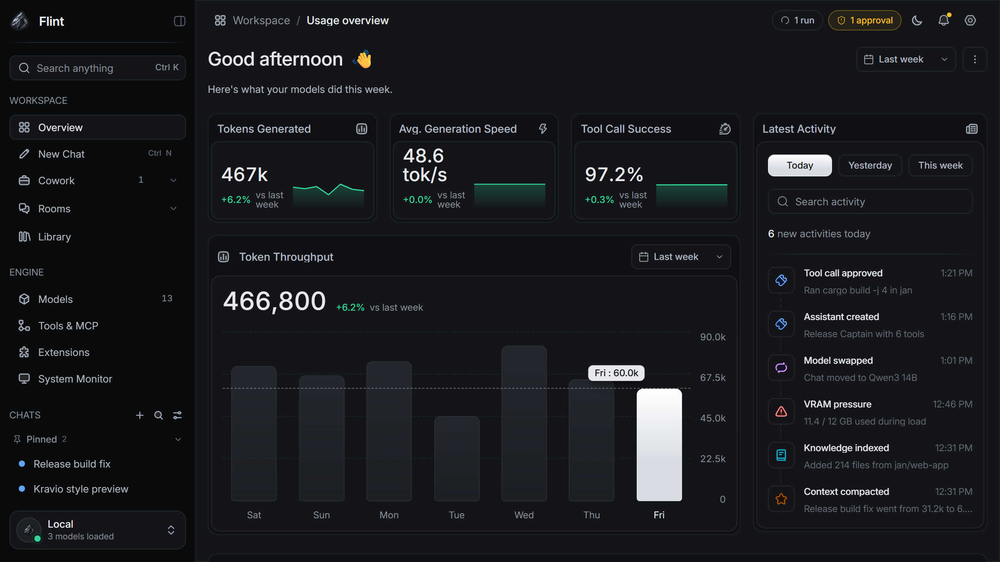
</p>

## What Flint is

- **Chat** for questions, writing and documents. Conversations stay on your computer, can be grouped into projects, and can run side by side in a split view.
- **Cowork** for tasks that touch files. An agent reads, writes and runs commands in a sandbox or a managed copy of your project, asks before doing anything you have not allowed, and ends every run with a plain summary of what it did, what it checked and what is left to review.
- **Local-first by design.** No telemetry, analytics or automatic update checks. Flint does not discover or download models in the background. Network access happens only for features you explicitly use: Hugging Face **Discover**, a cloud provider, a remote MCP server, or web search.

## Highlights

- **Discussion Rooms:** several models from different providers discuss a topic in one room, with a moderator, budgets, `@mentions`, optional file and tool access, and a final synthesis.
- **Agents that work together:** parallel sub-agents, six built-in roles (explorer, planner, implementer, reviewer, tester, security), teams, and sessions that can message one another.
- **Review before anything changes:** a diff before every write, per-hunk apply, managed Git worktrees, checkpoints and rewind, and flags on risky changes such as dependencies, lock files and migrations.
- **Permissions in plain language:** each prompt says what will happen and what denying does. "Allow once" is never saved, and every standing grant can be revoked.
- **"What Flint is using":** for every reply, you can see which model, instructions, memory, tools and attachments applied.
- **Honest run records:** a live tool timeline, replay, audit export, and summaries that only count real test, build and lint commands as checks.
- **Usage and cost:** token and prompt-cache counts per message and session, spend budgets, and a dashboard.
- **Your models:** browse and download GGUF models directly from Hugging Face in **Discover**, use MLX repositories on Apple silicon, import local files manually, or connect any OpenAI- or Anthropic-compatible provider with your own key. Keys are stored in the OS keyring.
- **Sandboxed shell commands** on every OS: bubblewrap on Linux, Seatbelt on macOS, AppContainer on Windows.
- **A command line** for headless agent runs, a JSON-lines API and background jobs.

See [docs/FEATURES.md](docs/FEATURES.md) for the full list and for what is not finished yet.

## Screenshots

All screenshots use an invented example project ("acme-weather") and made-up data.

| | |
|---|---|
| 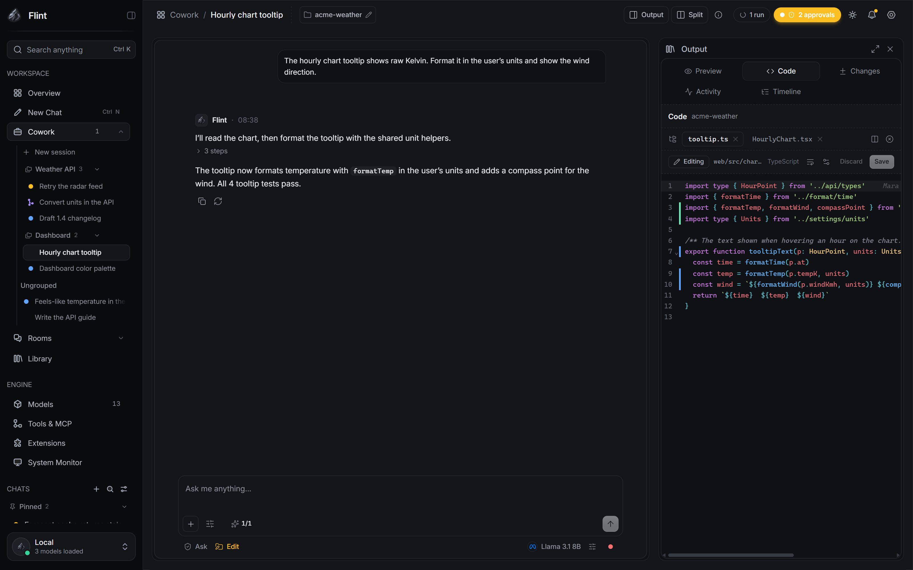<br>Code panel with change markers and blame | 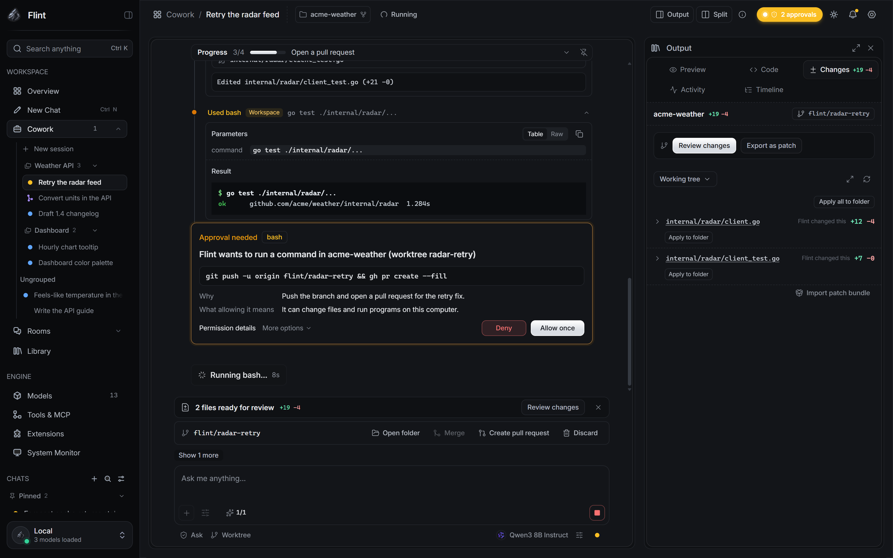<br>Cowork: tool calls, results and the Changes panel |
| 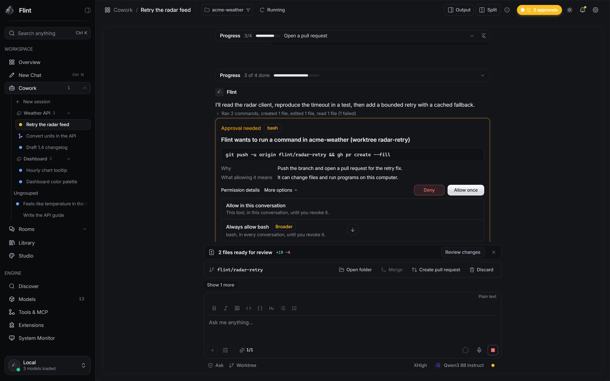<br>Approval card with its permission options | 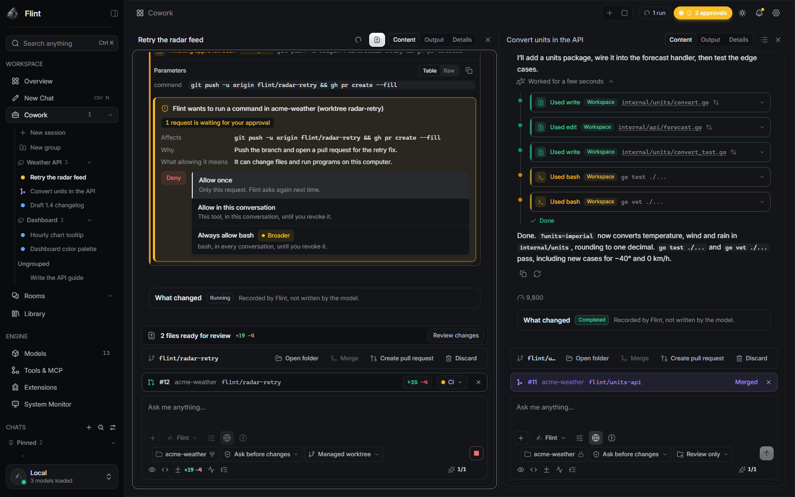<br>Two sessions, each in its own worktree |
| 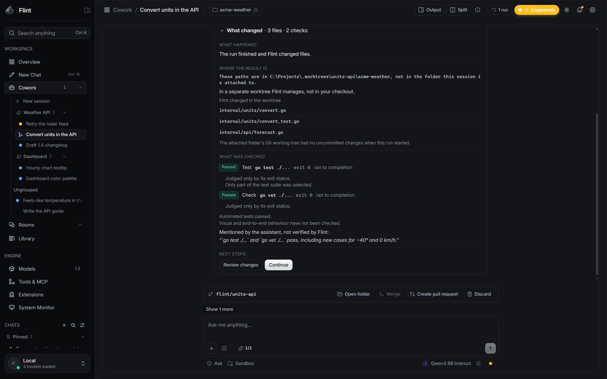<br>What changed: the run's own record | 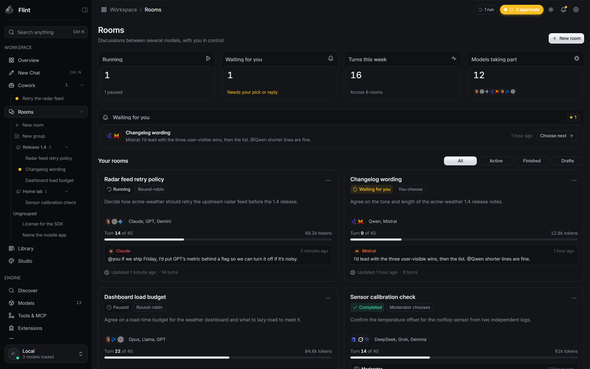<br>Rooms overview |
| 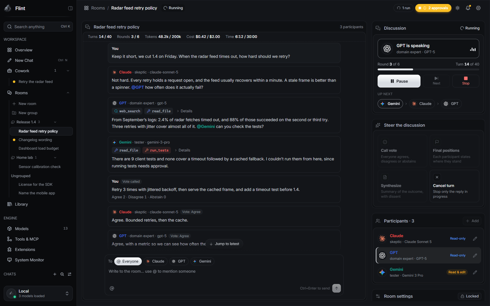<br>A Discussion Room with tool chips and a vote | 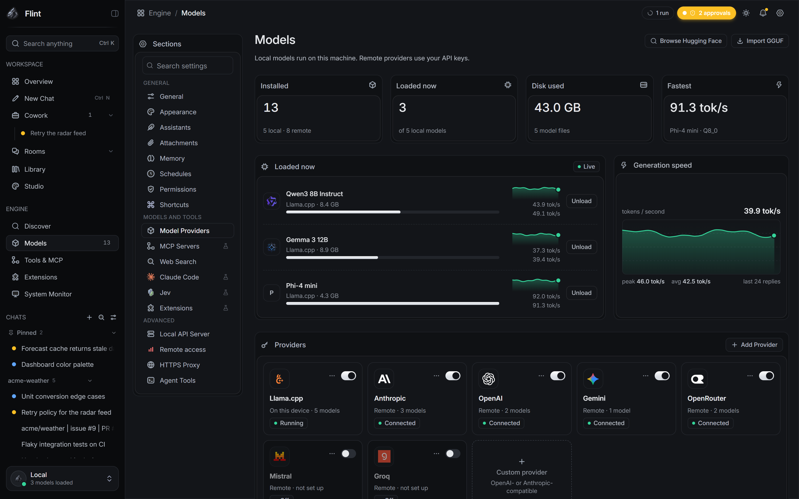<br>Models: loaded models and providers |
| 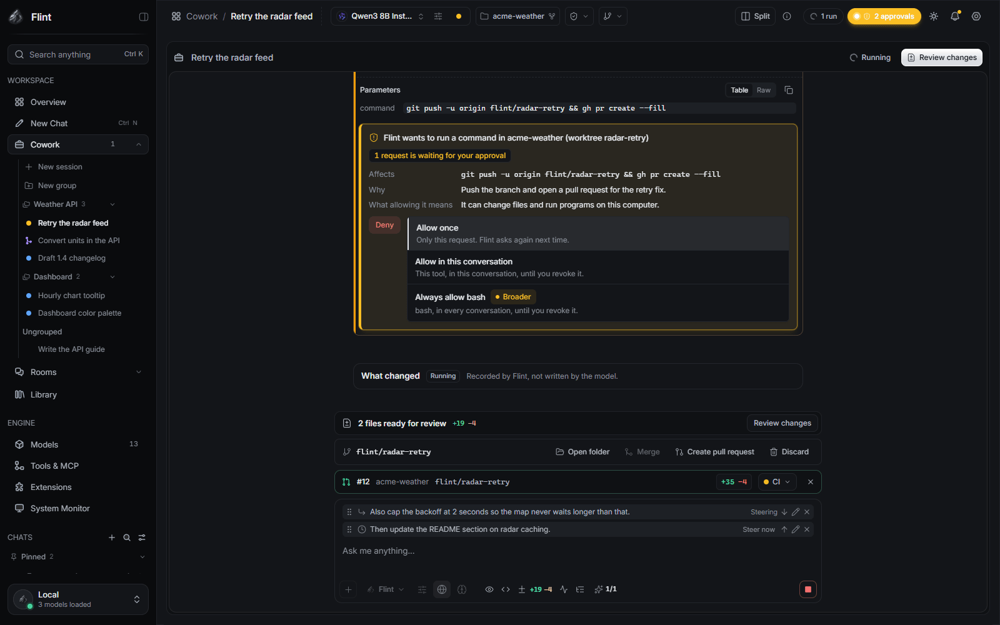<br>Steering and queued messages | 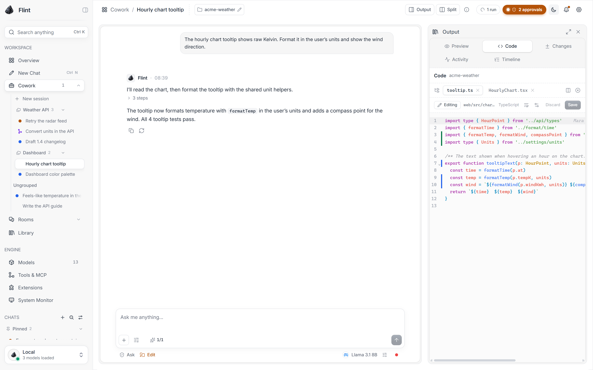<br>Light theme |
| 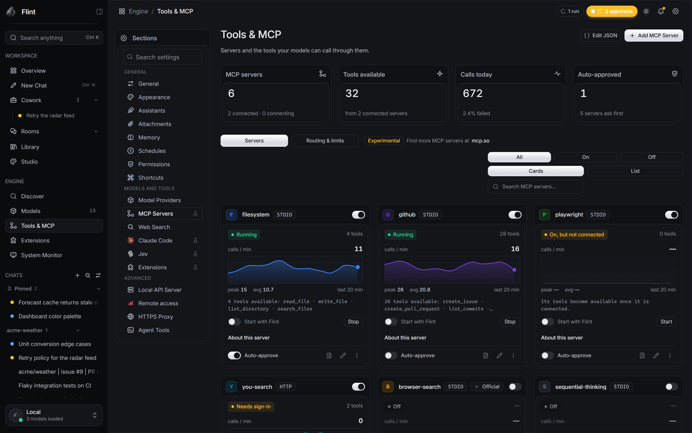<br>Tools and MCP servers | 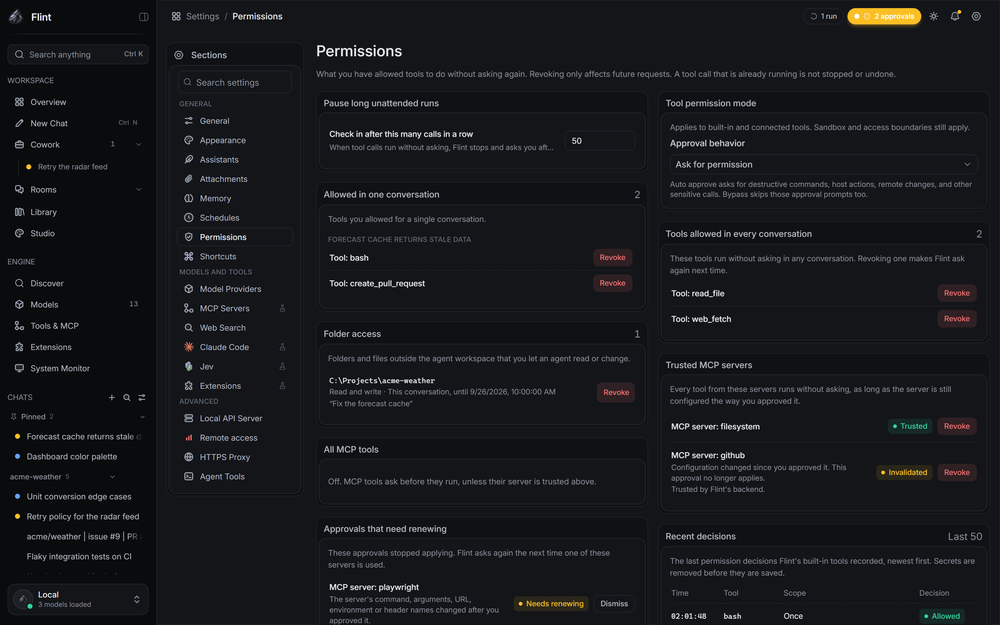<br>Permissions: every standing grant |
| 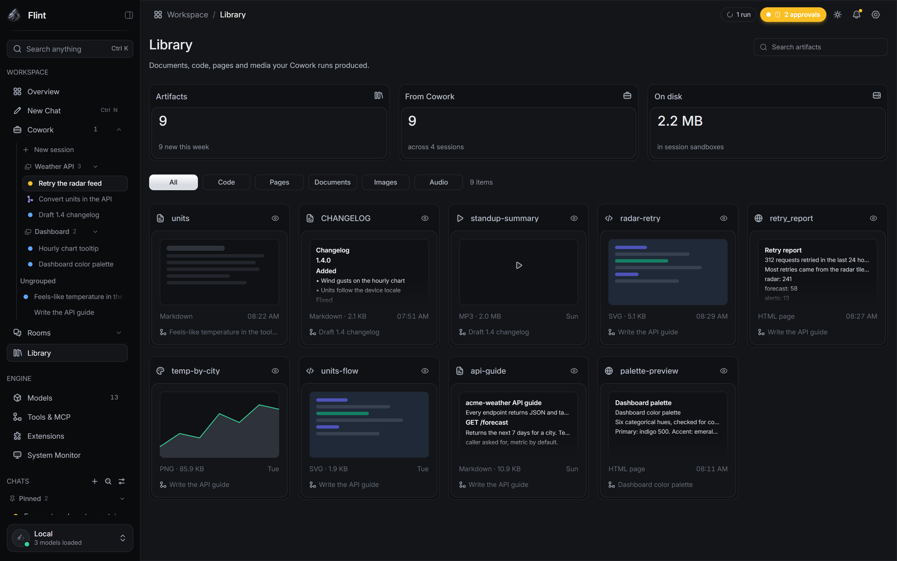<br>Library of Cowork artifacts | 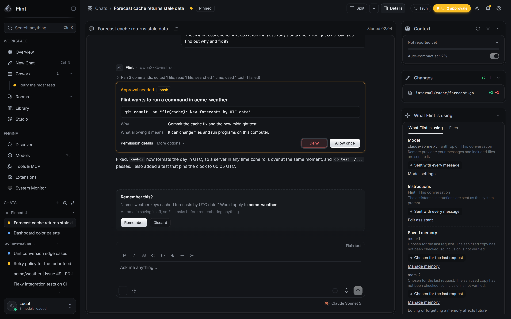<br>What Flint is using, per conversation |

## Install

Installers for Windows, macOS and Linux are attached to each release on the [Releases](https://github.com/Jozkah/flint/releases) page. If a release has no installer yet, [build Flint from source](docs/BUILDING.md).

The installers are **not code-signed**, so your OS warns you the first time you open Flint:

- **Windows:** SmartScreen shows "Windows protected your PC". Click **More info**, then **Run anyway**.
- **macOS:** right-click (or Control-click) Flint in Applications and choose **Open**, then **Open** again. Alternatively, try to open it once, then go to **System Settings → Privacy & Security** and click **Open Anyway**.
- **macOS local models need Apple silicon** (M1 or later). On Intel Macs you can still use cloud providers.

**Models are your choice.** Open **Discover** to search Hugging Face and choose the exact GGUF quantization (or MLX repository on Apple silicon) you want Flint to download. Downloads start only when you click **Download**, support pause/resume, and are size/hash verified when Hugging Face exposes that metadata. You can still import a GGUF you already have with **Import GGUF** on the **Models** page, or add a cloud provider with your own key.

## Getting started

1. **Open Flint.** A short first-run guide asks what you want to do and explains the difference between local and cloud processing. You can skip it and reopen it from Settings → General.
2. **Choose a model.** Open **Discover** to search/download one from Hugging Face, or **Models** to manage models and providers already configured. Flint marks a recommended quant using the same hardware-fit estimator as the Models page; an estimate never stops you from choosing another variant.
3. **Start a chat.** Attach files with **+**, and open **What Flint is using** in the header to see what applies to the conversation.
4. **Use Cowork for file work.** Attach a project folder or work in the sandbox, then describe the task. Flint asks before any change or command you have not allowed.
5. **Review the result.** The run summary says what happened and what is unresolved. The **Changes** panel shows real diffs, and checkpoints restore earlier states.

## Migrating from Jan

Flint keeps Jan's bundle identifier (`jan.ai.app`) and data path, so it detects an existing Jan install. On first launch, you can **copy** your Jan data into Flint, **reuse** it in place, **move** it (a backup is kept), or **start fresh**. You choose which categories to bring. A newer Flint item is never silently overwritten, and a failed migration rolls back. You can run the assistant again later from **Settings → General → Migrate from JAN**.

Jan compatibility is kept: `JAN_*` environment variables (with `FLINT_*` preferred), the `jan://` protocol (alongside `flint://`), and `JAN.md` project files (alongside `FLINT.md`) all still work. API keys stay in the OS keyring.

## Build from source

```bash
git clone https://github.com/Jozkah/flint.git
cd flint
corepack enable
yarn install
yarn build:tauri:plugin:api
yarn build:core
yarn build:extensions
make build-engine JAN_ENGINE_VARIANT=cpu
yarn build
```

The installers land in `src-tauri/target/release/bundle/`. On Windows, run the `make` line in Git Bash, not PowerShell.

Before you run these commands, install the toolchain (Git, Node 20+, Rust, CMake, Ninja and make, plus LLVM and the Visual Studio Build Tools on Windows). The first build needs about 30 GB of disk space.

To run Flint in development instead of building installers, replace the last two lines with `yarn download:bin` and `yarn dev`. That runs without the llama.cpp engine, so local models do not load until you run `make build-engine-dev JAN_ENGINE_VARIANT=cpu` once.

[docs/BUILDING.md](docs/BUILDING.md) covers the per-OS setup, building installers, the local llama.cpp engine and troubleshooting.

Contributions are welcome. See [CONTRIBUTING.md](CONTRIBUTING.md).

## License

Flint is licensed under the [Apache License 2.0](LICENSE), the same license as upstream Jan. Upstream copyright and attribution notices are kept in [`LICENSE`](LICENSE) and throughout the source.

## Acknowledgements

Flint builds on [Jan](https://github.com/janhq/jan), its contributors and its history. It also uses [llama.cpp](https://github.com/ggerganov/llama.cpp), [Tauri](https://tauri.app/) and [Scalar](https://github.com/scalar/scalar).
