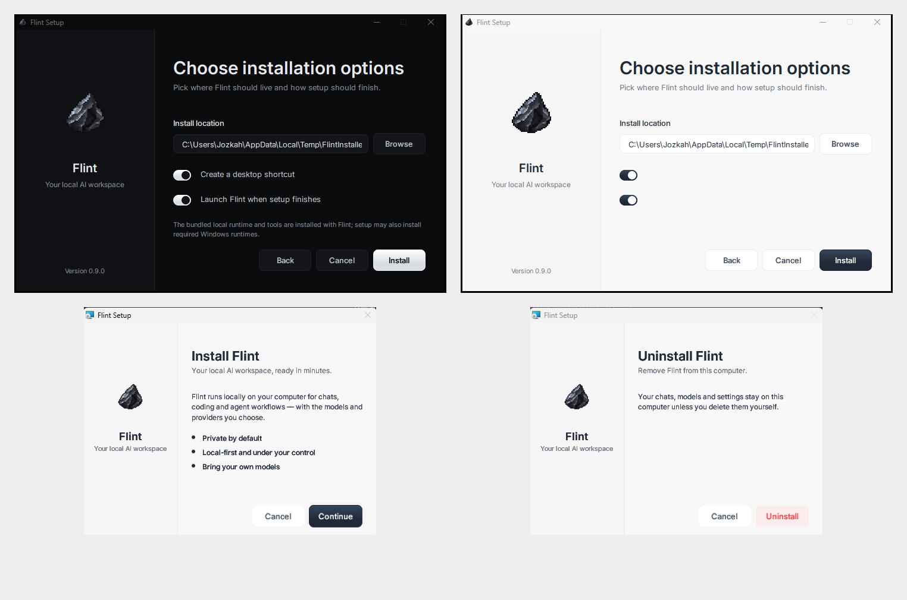

# Installer look

Flint's installers follow the app rather than the stock platform wizard where
the packaging format allows it. Colours, Inter, spacing, switches and button
surfaces come from the same design tokens used by the app.



| Target | What is styled | Where |
| --- | --- | --- |
| Windows NSIS | Full interactive wizard: welcome, installation options, existing-install maintenance, progress, completion, uninstall confirmation/progress/completion. Follows Windows light/dark app mode and scales to 100/125/150/200% DPI. | `windows/flint-ui.nsh`, wired through `../tauri.bundle.windows.nsis.template` |
| Windows MSI | Full custom wizard: welcome, install location, progress, done, uninstall, cancel and error dialogs, light only. Windows Installer draws the install-path field and the progress bar. | `wix/flint-ui.wxs`, `wix/main.wxs`, set in `../tauri.windows.conf.json` |
| macOS DMG | Finder backdrop and icon positions. | `dmg/`, set in `../tauri.macos.conf.json` |
| Linux | AppImage, deb and Flatpak have no installer wizard UI. | |

## Windows NSIS

The window keeps the native Windows title bar but the content is Flint-owned.
The title-bar icon and the large brand mark are loaded from the installer's own
resource 103, which is built from `src-tauri/icons/icon.ico`; there is no
separate or approximated installer logo.

The checked-in `tauri.bundle.windows.nsis.base.template` is the maintainable
Tauri-derived install logic. `scripts/prepare-windows-installer.mjs` applies a
small set of guarded transformations before a Windows bundle is produced:
stock welcome/directory/finish pages become Flint pages, maintenance is skinned,
interactive installs are no longer forced passive, and the matching uninstall
completion page is inserted. Each transformation must match exactly once, so an
upstream template change fails loudly instead of silently falling back to a
half-styled installer.

Release workflows currently substitute version/product/workspace placeholders
in `tauri.bundle.windows.nsis.template` before `make build`. The preparation
script deliberately preserves those substitutions when regenerating the custom
page flow.

Buttons are the app Button (`components/ui/button.tsx`) rendered to bitmaps by
`generate.py`: the primary gradient, the outline surface with
`--secondary-foreground` text, 8px radius, 13px Inter Medium, 36px tall, one set
per theme and DPI scale. They are `NSD_CreateBitmap` controls because nsDialogs
only delivers `NSD_OnClick` for controls it created; a static made with a raw
`CreateWindowExW` looks like a button and never fires. Labels are rasterised with
Windows GDI (hinted, no colour fringes) at the exact pixel size, so they stay
crisp at 100, 125, 150 and 200%. The path field, radio dots and switches are
bitmaps too; headings and body text are live Inter text.

The install and uninstall progress pages advance on their own once the files are
copied (`SetAutoClose true`), because the native Next button is parked
off-screen behind the Flint controls.

## Windows MSI

Windows Installer draws its own dialogs and cannot theme them, so `wix/main.wxs`
(Tauri's default template with the stock WixUI wizard swapped for `WixUI_Flint`)
loads `wix/flint-ui.wxs`. Each page is a full-size bitmap with the app tokens and
Inter baked in. Native controls appear only where a page needs live text: the
install path, the progress bar and its status line. `wix/flint-ui-dialogs.wxi`
(every dialog but the error one, from one spec in `generate.py`) and
`wix/flint-ui-binaries.wxi` are generated.

The MSI is light only. A push button always draws Windows' light 3D frame, and
on hover it draws it around every button of the dialog. On the light page that
frame is nearly invisible; on a dark page it is a bright rectangle around each
button. A dark MSI was tried and dropped for that reason, along with two ways
around it that do not work: a link overlay (it repaints over the artwork) and a
bitmap check box (it draws its own glyph and focus rectangle).

Things the format forces, and how the wizard works around them:

- Each button control is 4px larger than its bitmap and page-coloured strips
  cover the frame, so the button looks flat.
- A page bitmap is stretched to the dialog with nearest neighbour, so pages are
  drawn at exactly the size they are shown; a button bitmap is drawn unscaled.
- A bitmap only stays under the buttons if it is in the tab chain and comes first
  (`TabSkip="no"`).
- The error dialog must have `ErrorText` as its first control, which puts it under
  any bitmap, so it keeps the system look with dark text.
- `light` runs with ICE validation in Tauri's build, so the standard dialogs
  (`FilesInUse`, the error dialog) and the admin UI sequence entries are
  required even though they are rarely seen.
- Windows Installer is not DPI aware, so above 100% Windows scales the whole
  window, like every MSI.
- Text that Windows Installer draws itself uses Segoe UI, not Inter.

After changing the relevant app tokens, regenerate the committed artwork:

```sh
pip install pillow
python3 src-tauri/installer/generate.py
```

The normal Windows Tauri build runs the template preparation automatically via
`beforeBuildCommand`. `node --test scripts/*.test.mjs` also checks the wiring,
page transformation, real-icon usage and every required theme/DPI asset.
